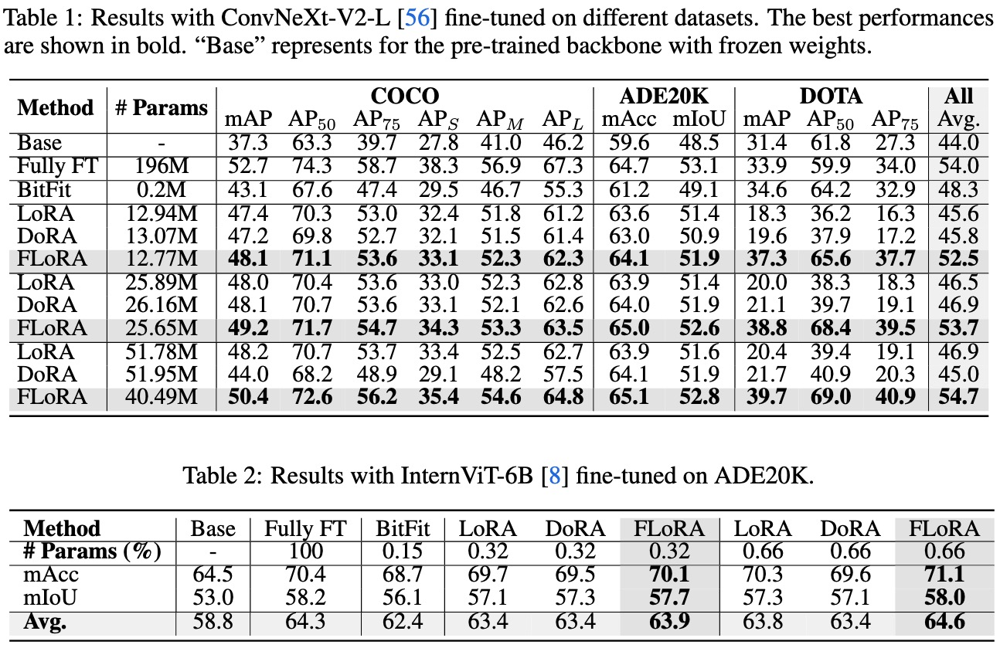
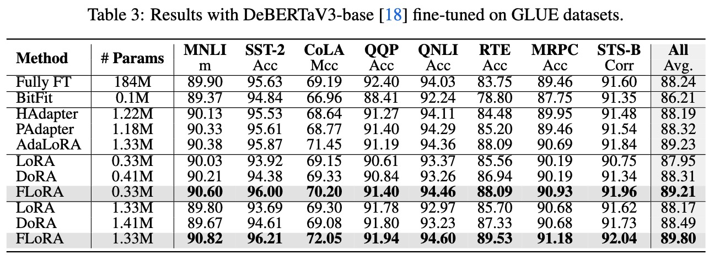
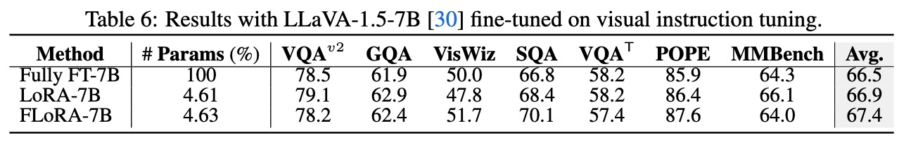
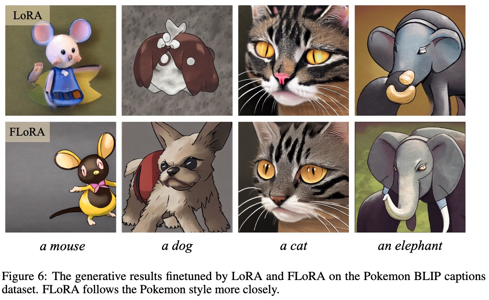
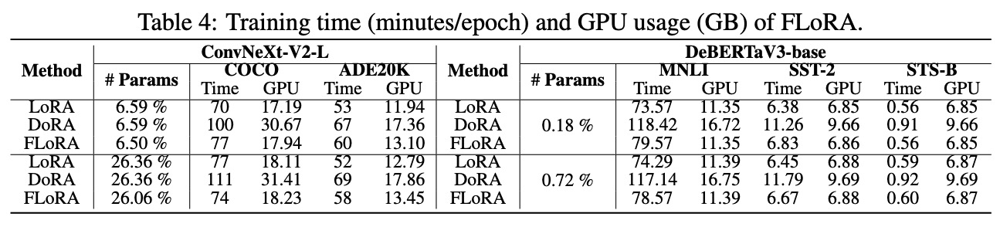

## 研究动机

随着各类通用基座大模型的兴起，预训练+指令微调的训练策略使得这些通用模型可以在特定任务，特定场景下实现更强的性能。然而，当前的大模型不光在性能方面提升大，在参数量的增长幅度以及对显存的需求量上也变的很大，因此，若使用传统的模型微调方式则往往需要对整个模型进行训练和调整，耗费大量计算资源。为了应对该问题，参数高效方法如雨后春笋冒出，其中最为典型的为微软提出的LoRA。该方法通过保持基座模型的参数不变，使用低秩矩阵来学习下游任务所需的参数，最后将低秩矩阵参数与原参数进行合并来获得适配任务的模型参数。这种方式大大降低了微调大模型所需要的资源与时间，同时在参数合并之后，推理所需时间与原模型一致，没有增加额外的运行时间。

然而，当前以LoRA为代表的众多低秩微调方法（包括 DoRA, MoRA, AdaLoRA等衍生方法），通常都更适合Linear层，Embedding层这类“直入直出”的低维度张量，忽略了对更高维度甚至N维张量的考虑。尽管这些方法可以通过一定方式将高维度张量转化为2D张量来微调参数，如LoRA将Conv2D卷积层参数所具有的四维张量$[d_{out},d_{in},k,k]$转化为二维张量$[d_{out}*k, d_{in}*k]$。但其存在两方面的问题：
1. 这种将卷积核$[k,k]$拆开分别reshape到$d_{in}$, $d_{out}$维上的方法虽然避免了参数的大规模增加，但是破坏了卷积核本身的结构特性。这对于密集预测类任务所需要的局部归纳偏置是一种负向影响。
2. 随着张量维度的升高，reshape为二维的方式会造成急剧的参数量增加，背离了参数高效微调方法的初衷。

为了解决以上两个问题，作者提出了**FLoRA方法**（flora意为植物群，具有广泛的寓意），认为**各维度参数的调整应该通过一个全局的低秩核心空间的子空间来进行，低秩核心空间本身则保留了原参数不同维度之间存在的拓扑关系以及交互性**。作者通过应用Tucker分解来实现对低秩核心空间的构建，完成了以统一视角来推导$N$维张量低秩微调方法的适配，使得低秩微调方法扩大到如Conv2D层, Embedding层，Linear层等各类常见层上。同时，作者发现通过调整不同的参数，FLoRA可以退化为多个不同的低秩微调方法。

## 适合N维张量的参数高效微调
### 当前LoRA类方法为什么会破坏结构
很简单，众所周知卷积具有局部学习的归纳偏置。若设置一个$d_{in}=1$, $d_{out}=10$, $k=3$的卷积层，其参数形状应该为[10,1,3,3]，后边两维[3,3]构成了一个具有正方形结构的滤波器。在按照$[d_{out}*k,d_{in}*k]$方式进行拆分过程中，既有permute的操作，也有reshape的操作，此时原本相邻的滤波器被打散。这增加了可学习参数来建模出原本的局部特性的难度。

### 为什么LoRA不把参数拆成$[d_{in}*d_{out}, k*k]$来避免破坏结构。
在卷积结构中，一层网络的参数$\mathcal{W}_c\in\mathbf{R}^{d_{in}\times d_{out} \times k\times k}$具有四个维度。若按照$[d_{out}*d_{in}, k*k]$方式将参数拆成对应LoRA中AB的形式，则应该为$\mathbf{A}_c \in \mathbb{R}^{d_{in}d_{out}\times r}$ 以及 $\mathbf{B}_c \in \mathbb{R}^{k^2\times r}$。若按照$[d_{out}*k,d_{in}*k]$方式将参数拆成对应LoRA中AB的形式，则应该为$\mathbf{A}_c \in \mathbb{R}^{kd_{out}\times r}$ 和 $\mathbf{B}_c \in \mathbb{R}^{kd_{in}\times r}$。

前者参数量为$d_{in}d_{out}r+k^2r$，后者参数量为${kr(d_{out}+d_{in})}$。当$k=3$时，分别为$r(d_{in}d_{out}+9)$ 和 $3r(d_{in}+d_{out})$，一般而言，$d_{in}d_{out}$ >> $d_{in}+d_{out}$，$[d_{in}*d_{out}, k*k]$方式会引入超大量的参数。因此转而使用后者是一种以结构完整性换参数量的折中。

### Tucker分解实现N维张量的低秩微调
Tucker分解是一种矩阵分解方法。对于具有N维的张量$\mathcal{X} \in \mathbb{R}^{I_1 \times I_2 \times \cdots \times I_N}$, Tucker分解可以将其表示为一个核张量(Core Tensor)与沿着每一维度得到的矩阵$\mathbf{A}^{(n)} \in \mathbb{R}^{I_n \times J_n}$的乘积，其中$J_n$为第$n$维的通道大小。可以写为：
$$\mathcal{X} = \mathcal{G} \times_1 \mathbf{A}^{(1)} \times_2 \mathbf{A}^{(2)} \times \cdots \times_N \mathbf{A}^{(N)}$$
其中$\times_n$便定义为一个张量(tensor)和一个矩阵(matric)的乘积。在Tucker分解中，核张量代表了不同维度之间的交互，而矩阵$\mathbf{A}^{(n)}$则类似于每一个维度的主成分。通过这种形式，依靠核张量去学习不同维度之间的关系，依靠各维度矩阵学习本维度的内在特性，可以在保留N维张量拓扑结构的基础上更好的优化学习过程。

基于以上对Tucker分解的介绍，作者便将这种分解方式引入到参数高效微调中。具体来说，相比于LoRA中
$$\mathcal{W}_0 \rightarrow \mathcal{W}_0 + s\Delta \mathcal{W} = \mathcal{W}_0 + s*BA^T\mathcal{W}$$

FLoRA将N维张量分解统一设计为:
$$\mathcal{W}_0 \rightarrow \mathcal{W}_0 + s *\Delta\mathcal{W}= \mathcal{W}_0 + s * \mathcal{G} \times_1 \mathbf{A}^{(1)} \times_2 \mathbf{A}^{(2)} \times \cdots \times_N \mathbf{A}^{(N)}$$
其中$\mathcal{G} \in \mathbb{R}^{J_1 \times J_2 \times \cdots \times J_N}$ 为核张量，$\mathbf{A}^{(n)} \in \mathbb{R}^{I_n \times J_n}$为第n维的低秩矩阵，这里的$J_n$就是低秩$r$，且 $J_n\ll I_n$。

---

对应于具有4个维度的卷积核参数$\mathcal{W}_c\in\mathbf{R}^{d_{in}\times d_{out} \times k\times k}$，则有
$$  \Delta\mathcal{W}= \mathcal{G} \times_1 \mathbf{A} \times_2 \mathbf{B} \times_3 \mathbf{C} \times_4 \mathbf{D}$$
其中$\mathcal{G}\in\mathbb{R}^{r_1\times r_2\times r_3\times r_3}$, $\mathbf{A}\in\mathbb{R}^{d_{in}\times r_1}$, $\mathbf{B}\in\mathbb{R}^{d_{out}\times r_2}$以及$\mathbf{C}, \mathbf{D}\in\mathbb{R}^{k\times r_3}$。$r_3$和$r_4$一般取相同的比卷积核大小$k$更小的值。根据上式，作者认为在卷积参数微调中具有一个卷积核心(Convolution Core)，而FLoRA负责找到了这个核心的值并且配置了不同维度的权重值。与LoRA相比，在相近参数量上FLoRA允许设置更大的秩$r$，在同等秩的情况下，FLoRA大大降低了参数量。

> 举例：若$k=3, r_3=r_4=2, r_1=r_2=r=32, d_{in}=256, d_{out}=512$
>
>FLoRA的参数量为：$r_3r_4 r^2+r(d_{in}+d_{out}) + r_3k + r_4k=4096+24576+6+6=28684$，
>
>LoRA的参数量为：$rkd_{in}+rkd_{out}=24576+49152=73728$; 
>
>若FLoRA达到与LoRA相同的参数量，则$r=70$。

---

对应于具有2个维度的线性层参数$\mathbf{W}_l\in\mathbb{R}^{d_{in}\times d_{out} }$,则有
$$    \Delta\mathbf{W} = \mathcal{G} \times_1 \mathbf{A} \times_2 \mathbf{B} = \mathbf{A}\mathbf{G}\mathbf{B}^\mathsf{T}, $$
其中$\mathcal{G}\in\mathbb{R}^{r_1\times r_2}$, $\mathbf{A}\in\mathbb{R}^{d_{in}\times r_1}$, $\mathbf{B}\in\mathbb{R}^{d_{out}\times r_2}$，而因为$C,D$的$r,k$都为1，成为了一个标量，可以合并到缩放因子$s$中。与4维的卷积核参数类比，这里的$G$便是对应的线性核心。

参考上边的例子，同等$r$的情况下，FLoRA参数量为$d_{in} \times r + d_{out} \times r + r^2$，相比LoRA仅多出$\frac{r}{d_{in}+d_{out}}$\% 的参数，对应该例子为4.17\%。在实际应用中，由于核张量的存在，等效的$r_1，r_2$可以小于LoRA的$r$,从而实现同等规模甚至更少的参数量情况下，效果与LoRA一致甚至更好。

---

在LoRA中，$s$的取值由$r$和另一超参$r\_alpha$决定，通常固定$s=2$。在FLoRA中，该值以超参形式设定为一个固定值，不需要引入$r\_alpha$，本质上$s$代替了$r\_alpha$，因此相比LoRA没有引入额外数量的超参。对于$s$的选取，作者在实验过程中发现对于不同大小规模的参数量以及不同类型的模型（即不同维度的参数空间），取值不一，但呈现出了一定的特点。对于卷积模型来说，$s$的取值在一定范围内越大越好，在以ConvNext-L为backbone来微调时设置为4；对于线性模型来说，$s$的取值尽量较小，在微调InternViT-6B和LLaVA-7B时，$s$的值设置为0.04。*作者猜测这与原参数的参数尺度有关系，通过设置adaptive的$s$使得该值与原参数均值在同一个尺度对猜想做了初步验证，结果与手动设置的效果基本一致。*

## 实验
作者分别在视觉任务，语言任务，多模态任务上做了实验，涵盖了2种类型模型（Conv与ViT），4种参数规模(DeBERTav3-base: 86M，ConvNeXt-large: 900M, InternViT-6B, LLava-v1.5-7B)，涉及18个数据集。

在视觉任务中，FLoRA在3种任务上都取得了明显的性能提升，甚至在比LoRA低少80%参数的情况下，依然可以取得和LoRA一致的效果。实验结果说明了通过引入核张量来建模维度关系，从而避免破坏拓扑结构的方式是利于多维度参数微调的，并且可以取得很好的效果。

在语言任务上作者也相应的做了一些实验，并且在所有的可调参数规模下都实现了明显的性能增长。

在多模态任务上作者也基于llava-v1.5-7b做了visual instruct tuning的测评。同样显示出了比LoRA更好的效果。

作者也做了扩散模型的微调，并给出了生成结果的对比。

对于FLoRA和LoRA相比在训练时间与显存开销上的区别，作者也给出了数据说明。

更多内容可以查看论文原文，作者反馈：核心实现代码以及不同任务完整代码也即将于近期陆续开源。