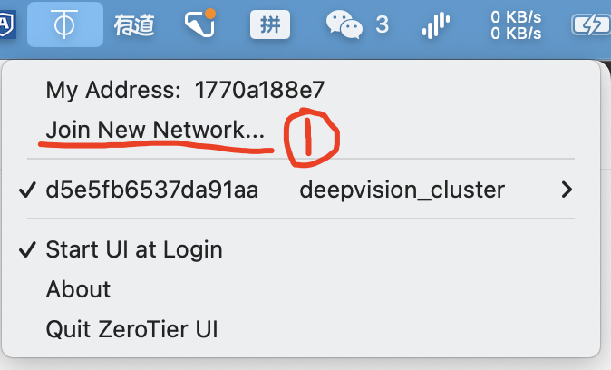
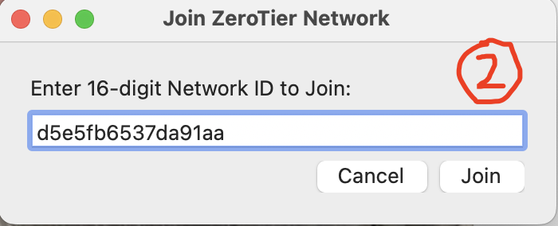
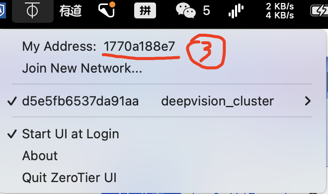

# How To Join Our Zerotier Network

This page demonstrates the way of joining our Zerotier network for Mac, Linux, Windows. You can access our private resources such like GPU servers, docs only and any other materials when you are granted a virtual IP address by Zerotier.

## Download Zerotier APP

You can follow the [official instructions ](https://www.zerotier.com/download/) to install the Zerotier APP on your devices.

You can also refer to the following steps:

**Linux**

```bash
curl -s https://install.zerotier.com | sudo bash
```

**Mac**

```md
Download Link: https://download.zerotier.com/dist/ZeroTier%20One.pkg

Install it as other APPs in you Mac.
```

**Windows**

```md
Download Link: https://download.zerotier.com/dist/ZeroTier%20One.msi

Install it as other APPs in you Mac.
```

## Join self-host Moon

**Linux/Mac/Windows**

Run the followings on your terminal. *Note that Windows users should open the powershell with the administrator privilege and the 'sudo' is not needed.*

```bash
sudo zerotier-cli orbit 681475fc6d 681475fc6d
# wait for 1 minute
sudo zerotier-cli listpeers

#check whether '118.25.27.204' in the output lines, for example:
#200 listpeers 681475fc6d 118.25.27.204/9993;263;257 5(这里可能不一样) 1.12.2 MOON
```

## Join Our Network
Join our network with terminel or GUI app. Remember your address id and tell it to network admins: :tipping_hand_man: wangxuehui, :tipping_hand_man: yangchen.

With terminals:

- **Linux/Mac/Windows**

```bash
sudo zerotier-cli join 75f2c4cdf0d34510

#remember you address:
sudo zerotier-cli info
```


With GUI:

This is an **example** for Mac and Windows users. You should copy **75f2c4cdf0d34510** as the input of Step 2.

- **Mac/Windows**







## More

No more
