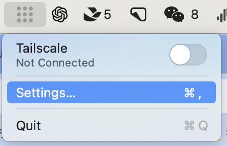
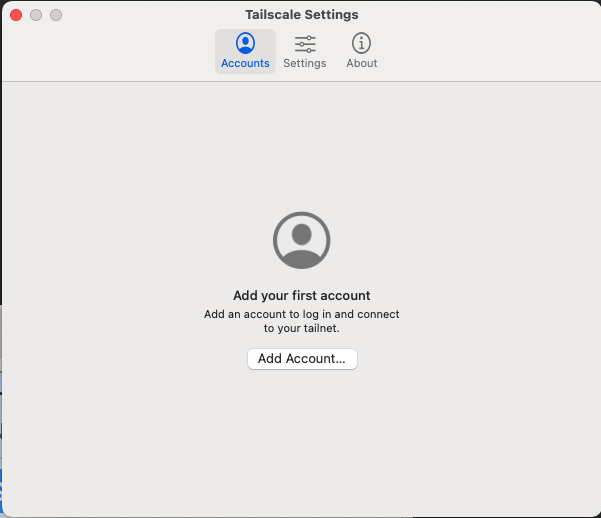
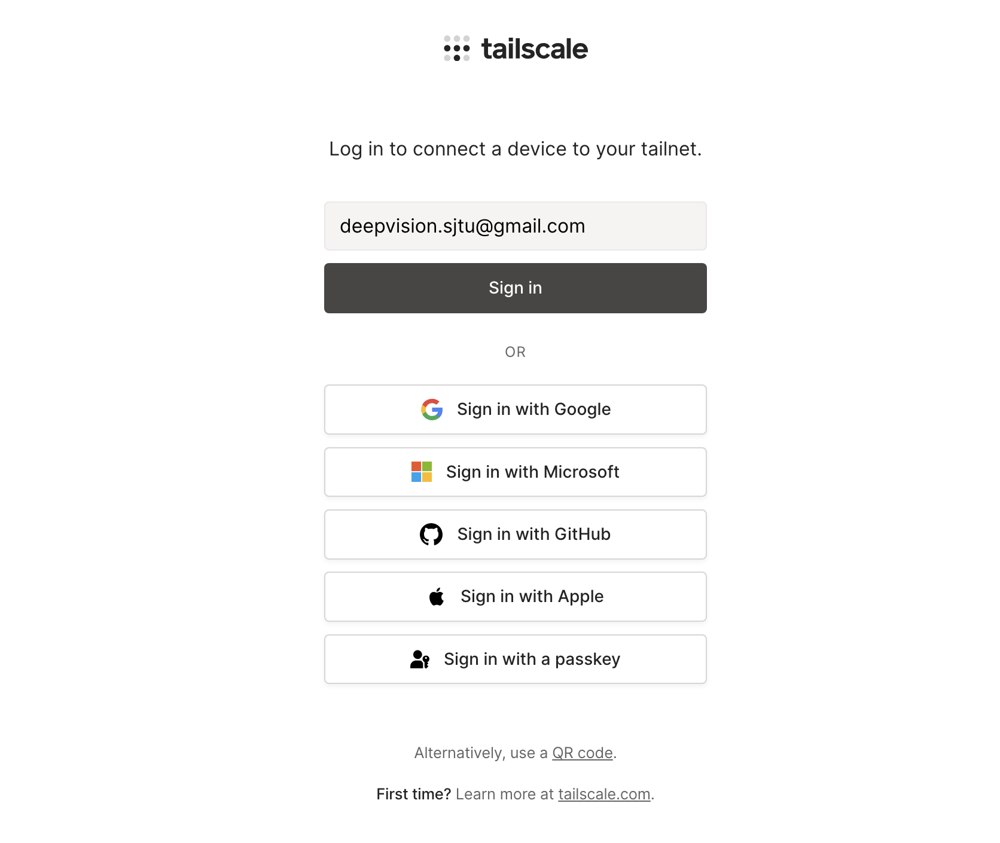
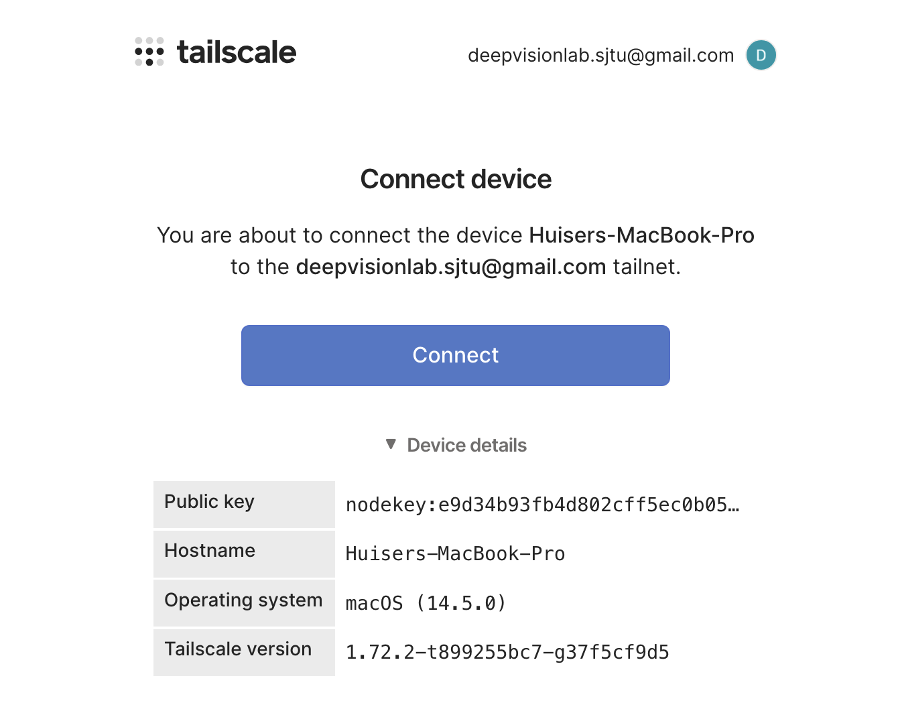
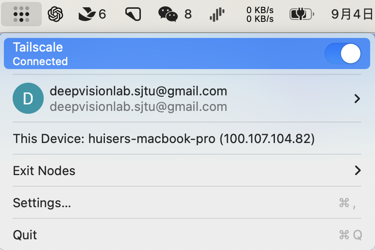

# How To Join Our Zerotier Network

This page demonstrates the way of joining our Tailnet for Mac, Linux, Windows, iPhone, Andriod. You can access our private resources such like GPU servers, docs and any other materials when you are granted a virtual IP address by Tailnet.

**We remove zerotier since it may encounter some stability issues, which often resulting in connection timeout. Meanwhile, Tailnet is much easier than zerotier to configure. You only need to install it and then login in with our public account. Moreover, Tailnet provides some interesting features, such like TailDrop, a sharing tool like AirDrop.**

## Download Tailscale APP

You can follow the [official instructions ](https://tailscale.com/download/) to install the Tailscale APP on your devices.

You can also refer to the following steps:

**Linux**

```bash
curl -fsSL https://tailscale.com/install.sh | sudo sh
```

**Mac**

```md
Download Link: https://pkgs.tailscale.com/stable/Tailscale-latest-macos.pkg

Install it as other APPs in you Mac.
```

**Windows**

```md
Download Link: https://pkgs.tailscale.com/stable/tailscale-setup-latest.exe

Install it as other APPs in you Windows.
```

**iPhone**
```md
Download Tailscale from App Store: https://apps.apple.com/us/app/tailscale/id1470499037?ls=1
```

**Android**
```md
Download Tailscale from Google Play: https://play.google.com/store/apps/details?id=com.tailscale.ipn
```

## Join self-host Moon

**Linux/Mac/Windows**

Run the followings on your terminal. *Note that Windows users should open the powershell with the administrator privilege and the 'sudo' is not needed.*

```bash
sudo zerotier-cli orbit 681475fc6d 681475fc6d
# wait for 1 minute
sudo zerotier-cli listpeers

#check whether '118.25.27.204' in the output lines, for example:
#200 listpeers 681475fc6d 118.25.27.204/9993;263;257 5(这里可能不一样) 1.12.2 MOON
```

## Join Our Tailnet

- Open the Tailscale application and then click 'settings':

  
---

- Add accounts:
    
    
---

- Login with the account we provided:

    
---

- Click 'connect' to bind your device with our account:
  
    
---

- Check status and you can observe that a virtual IP is assigned to your device: 

    
---


## Enjoy it
Keep it opening like other VPN apps and feel free to connect to any private resources from Deepvision Lab!

